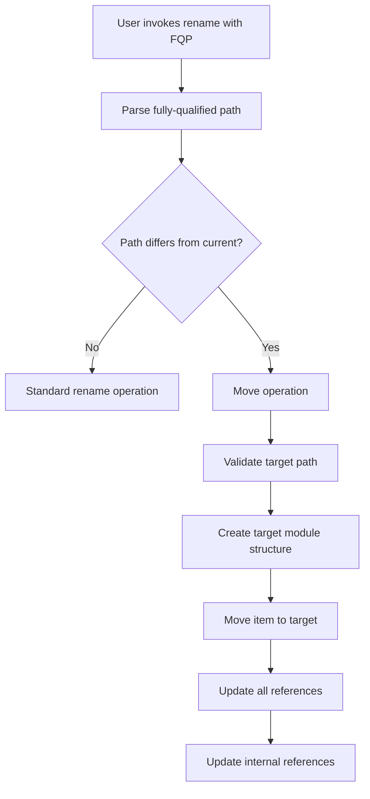

# Design Document

## Overview

This design extends rust-analyzer's existing rename functionality to support moving items between modules using fully-qualified paths. The feature builds upon the current rename infrastructure in `crates/ide/src/rename.rs` and `crates/ide-db/src/rename.rs`, adding path parsing, module creation, and enhanced reference updating capabilities.

## Architecture

### High-Level Flow



### Core Components

#### 1. Path Analysis Component
- **Location**: `crates/ide/src/rename.rs` (new functions)
- **Responsibility**: Parse and analyze fully-qualified paths using existing rust-analyzer infrastructure
- **Key Functions**:
  - `parse_fully_qualified_path(path: &str) -> Result<ModPath>` (leverages existing `ModPath::from_src`)
  - `compare_paths(current: &ModPath, target: &ModPath) -> PathComparison`
- **Existing Infrastructure**: Utilizes `hir_expand::mod_path::ModPath` and `convert_path` functions

#### 2. Module Creation Component  
- **Location**: `crates/ide-db/src/rename.rs` (new module)
- **Responsibility**: Create missing module structure
- **Key Functions**:
  - `create_module_structure(sema: &Semantics, target_path: &ModPath) -> Result<ModuleCreationPlan>`
  - `execute_module_creation(plan: ModuleCreationPlan) -> Result<Vec<FileSystemEdit>>`

#### 3. Item Movement Component
- **Location**: `crates/ide-db/src/rename.rs` (enhanced)
- **Responsibility**: Move items and update references
- **Key Functions**:
  - `move_item_to_module(item: Definition, target_module: Module, new_name: &str) -> Result<SourceChange>`
  - `update_internal_references(item_source: &SyntaxNode, old_module: Module, new_module: Module) -> Result<TextEdit>`

## Components and Interfaces

### Reference Update Strategy

The design addresses two critical types of reference updates required by the specifications:

#### External Reference Updates (Requirements 3.1-3.5)
- **Import Statement Updates**: Modify `use` statements to reflect new item location
- **Fully-Qualified Path Updates**: Update `crate::old::path::Item` to `crate::new::path::Item`
- **Re-export Handling**: Update `pub use` statements and maintain export chains
- **Alias Preservation**: Maintain existing import aliases where syntactically valid

#### Internal Reference Updates (Requirements 6.1-6.5)
- **Relative Path Adjustment**: Update `super::`, `self::` references for new module context
- **Sibling Module References**: Adjust references to peer modules when hierarchy changes
- **Self-Referential Paths**: Update paths that reference the item's own module
- **Crate Root References**: Ensure `crate::` paths remain valid from new location

### Path Analysis Using Existing Infrastructure

The design leverages rust-analyzer's existing `ModPath` infrastructure instead of creating custom path structures:

```rust
// Reuse existing ModPath from hir_expand::mod_path
use hir_expand::mod_path::{ModPath, PathKind};

#[derive(Debug, PartialEq)]
pub enum PathComparison {
    SameLocation,      // Only name change (Requirement 5.1)
    DifferentModule,   // Move required (Requirement 1.2)
    Invalid,           // Invalid path syntax (Requirement 1.3)
}

// Parse using existing infrastructure
fn parse_rename_target(input: &str, db: &dyn ExpandDatabase) -> Result<ModPath> {
    // Parse as AST path first
    let parsed = syntax::ast::SourceFile::parse(&format!("use {};", input), Edition::CURRENT);
    if !parsed.errors().is_empty() {
        return Err(MoveRenameError::InvalidPath(format!("Invalid path syntax: {}", input)));
    }
    
    // Extract path and convert using existing ModPath::from_src
    let use_stmt = parsed.tree().items().find_map(|item| match item {
        syntax::ast::Item::Use(use_stmt) => use_stmt.use_tree()?.path(),
        _ => None,
    })?;
    
    ModPath::from_src(db, use_stmt, &mut |_| SyntaxContext::root())
        .ok_or_else(|| MoveRenameError::InvalidPath(format!("Could not parse path: {}", input)))
}
```

### ModuleCreationPlan Structure

```rust
#[derive(Debug)]
pub struct ModuleCreationPlan {
    pub directories_to_create: Vec<PathBuf>,
    pub files_to_create: Vec<ModuleFileSpec>,
    pub module_declarations_to_add: Vec<ModuleDeclaration>,
    pub user_preferences: ModuleOrganizationPreferences, // Requirement 2.3
}

#[derive(Debug)]
pub struct ModuleFileSpec {
    pub path: PathBuf,
    pub content: String,
    pub file_type: ModuleFileType,
}

#[derive(Debug)]
pub enum ModuleFileType {
    ModRs,      // mod.rs file (Requirement 2.2)
    ModuleFile, // module_name.rs file (Requirement 2.2)
}

#[derive(Debug)]
pub struct ModuleDeclaration {
    pub parent_file: FileId,
    pub module_name: String,
    pub insert_position: TextSize,
    pub visibility: Option<String>, // pub, pub(crate), etc.
}

#[derive(Debug)]
pub struct ModuleOrganizationPreferences {
    pub prefer_mod_rs: bool,
    pub directory_structure: DirectoryStructurePreference,
}

#[derive(Debug)]
pub enum DirectoryStructurePreference {
    Nested,    // src/module/submodule/
    Flat,      // src/module_submodule.rs
}
```

## Data Models

### Enhanced Rename Context

```rust
pub struct RenameContext {
    pub original_def: Definition,
    pub original_name: Name,
    pub target_module_path: ModPath,  // Using existing ModPath
    pub new_item_name: Name,
    pub operation_type: RenameOperationType,
    pub source_module: Module,
}

#[derive(Debug, PartialEq)]
pub enum RenameOperationType {
    SimpleRename,     // Same module, name change only (Requirement 5.1)
    MoveAndRename,    // Different module, name change (Requirement 1.2)
    MoveOnly,         // Different module, same name (Requirement 1.2)
    RelativeMove,     // Relative path within current module (Requirement 5.2)
}
```

### Module Structure Tracking

```rust
pub struct ModuleStructure {
    pub current_module: Module,
    pub target_module_path: ModPath,
    pub missing_segments: Vec<String>,
    pub existing_segments: Vec<Module>,
}

#[derive(Debug)]
pub struct InternalReference {
    pub range: TextRange,
    pub reference_type: InternalReferenceType,
    pub original_path: String,
}

#[derive(Debug)]
pub enum InternalReferenceType {
    SuperReference,    // super::module (Requirement 6.3)
    CrateReference,    // crate::module (Requirement 6.3)
    SiblingReference,  // sibling module references (Requirement 6.5)
    SelfReference,     // self-referential paths (Requirement 6.4)
}

#[derive(Debug)]
pub struct ReferenceUpdateContext {
    pub old_module_path: ModPath,
    pub new_module_path: ModPath,
    pub item_name: Name,
    pub preserve_aliases: bool, // Requirement 3.5
}
```

## Error Handling

### Error Types

```rust
#[derive(Debug)]
pub enum MoveRenameError {
    InvalidPath(String),                                                    // Requirement 1.3
    ModuleCreationFailed(String),                                          // Requirement 2.1
    NameConflict { existing_item: String, target_name: String },           // Requirement 4.1
    CircularDependency(String),                                            // Requirement 4.3
    VisibilityViolation(String),                                           // Requirement 4.5
    FileSystemError(String),                                               // General file operations
    DependencyError(String),                                               // Requirement 4.2
    ModuleIntegrationFailed(String),                                       // Requirement 2.5
    ReferenceUpdateFailed { file: String, error: String },                // Requirements 3.1-3.5, 6.1-6.5
}
```

### Error Recovery Strategies

1. **Path Validation Errors**: Provide suggestions for valid path formats
2. **Name Conflicts**: Offer alternative names or show conflicting items
3. **Module Creation Failures**: Rollback partial changes and report specific issues
4. **Visibility Violations**: Suggest visibility modifiers or alternative locations

## Testing Strategy

### Unit Tests

1. **Path Parsing Tests**
   - Valid fully-qualified paths (`crate::module::Item`)
   - Relative paths within same module
   - Invalid path formats
   - Edge cases (keywords, reserved names)

2. **Module Creation Tests**
   - Creating nested module structures
   - Handling existing modules
   - File naming conventions (mod.rs vs module_name.rs)
   - Module declaration insertion

3. **Reference Update Tests**
   - Updating import statements
   - Updating fully-qualified references
   - Handling re-exports
   - Internal reference updates within moved items

### Integration Tests

1. **End-to-End Move Operations**
   - Move struct between modules
   - Move function with dependencies
   - Move enum with associated implementations
   - Move module containing multiple items

2. **Complex Scenarios**
   - Moving items with circular references
   - Moving items with macro usage
   - Moving items across crate boundaries (error cases)
   - Moving items with visibility constraints

### Test Data Structure

```rust
#[derive(Debug)]
pub struct MoveRenameTestCase {
    pub name: &'static str,
    pub initial_code: &'static str,
    pub rename_target: &'static str,
    pub new_name: &'static str,
    pub expected_result: Result<&'static str, &'static str>,
    pub expected_file_changes: Vec<ExpectedFileChange>,
}

#[derive(Debug)]
pub struct ExpectedFileChange {
    pub file_path: &'static str,
    pub change_type: FileChangeType,
    pub content: Option<&'static str>,
}

#[derive(Debug)]
pub enum FileChangeType {
    Created,
    Modified,
    Moved { from: &'static str, to: &'static str },
}
```

## Implementation Details

### Phase 0: Validation and Conflict Detection

Before executing any move operation, comprehensive validation ensures the operation is safe:

```rust
fn validate_move_operation(
    sema: &Semantics<'_, RootDatabase>,
    def: Definition,
    target_module_path: &ModPath,
    new_item_name: &Name,
    target_module: Module,
) -> Result<(), MoveRenameError> {
    // Check for name conflicts (Requirement 4.1)
    if let Some(existing_item) = find_existing_item_in_module(sema, &target_module, new_item_name) {
        return Err(MoveRenameError::NameConflict {
            existing_item: existing_item.name(sema.db).to_string(),
            target_name: new_item_name.as_str().to_string(),
        });
    }
    
    // Validate circular dependency prevention (Requirement 4.3)
    if would_create_circular_dependency(sema, def, target_module)? {
        return Err(MoveRenameError::CircularDependency(
            format!("Moving {} would create circular dependency", def.name(sema.db))
        ));
    }
    
    // Check visibility constraints (Requirement 4.4, 4.5)
    validate_visibility_constraints(sema, def, target_module)?;
    
    // Validate dependencies can be maintained (Requirement 4.2)
    validate_dependency_accessibility(sema, def, target_module)?;
    
    Ok(())
}

fn validate_visibility_constraints(
    sema: &Semantics<'_, RootDatabase>,
    def: Definition,
    target_module: Module,
) -> Result<(), MoveRenameError> {
    // Ensure moved items maintain their visibility constraints (Requirement 4.4)
    let current_visibility = get_item_visibility(sema, def)?;
    let target_module_visibility = get_module_visibility(sema, target_module)?;
    
    // Check if move would violate Rust's module privacy rules (Requirement 4.5)
    if !is_visibility_compatible(current_visibility, target_module_visibility) {
        return Err(MoveRenameError::VisibilityViolation(
            format!("Moving item would violate visibility constraints")
        ));
    }
    
    // Validate that existing references will remain accessible
    let usages = def.usages(sema).all();
    for (file_id, references) in usages {
        for reference in references {
            if !will_reference_remain_accessible(sema, reference, def, target_module)? {
                return Err(MoveRenameError::VisibilityViolation(
                    format!("Reference at {}:{} would become inaccessible", 
                           file_id.file_id(sema.db).index(), reference.range.start())
                ));
            }
        }
    }
    
    Ok(())
}
```

### Phase 1: Path Analysis Enhancement

Extend the existing `rename` function in `crates/ide/src/rename.rs`:

```rust
pub(crate) fn rename(
    db: &RootDatabase,
    position: FilePosition,
    new_name: &str,
) -> RenameResult<SourceChange> {
    // Parse the new_name to detect fully-qualified paths (Requirement 1.1)
    let (target_module_path, new_item_name) = parse_fully_qualified_path(new_name, db)?;
    
    // Path validation is handled by existing ModPath::from_src (Requirement 1.3)
    
    // Determine if this is a move operation (Requirement 1.2)
    let current_def = find_definition_at_position(db, position)?;
    let operation_type = determine_operation_type(&current_def, &target_module_path, &new_item_name)?;
    
    match operation_type {
        RenameOperationType::SimpleRename => {
            // Use existing rename logic (Requirement 5.4, 5.5)
            existing_rename_logic(db, position, &new_item_name.as_str())
        }
        RenameOperationType::RelativeMove => {
            // Handle relative moves within same module (Requirement 5.2, 5.3)
            execute_relative_move(db, current_def, target_module_path, new_item_name)
        }
        RenameOperationType::MoveAndRename | RenameOperationType::MoveOnly => {
            // New move logic (Requirement 1.2)
            execute_move_operation(db, current_def, target_module_path, new_item_name)
        }
    }
}

fn parse_fully_qualified_path(path: &str, db: &dyn ExpandDatabase) -> Result<(ModPath, Name)> {
    // Parse using existing rust-analyzer infrastructure
    let mod_path = parse_rename_target(path, db)?;
    
    // Extract item name from final segment (Requirement 1.4)
    let item_name = mod_path.segments().last()
        .ok_or_else(|| MoveRenameError::InvalidPath("Path must contain at least one segment".to_string()))?
        .clone();
    
    // Create module path by removing final segment (Requirement 1.5)
    let mut module_segments = mod_path.segments().to_vec();
    module_segments.pop(); // Remove item name
    
    let module_path = if module_segments.is_empty() {
        // Item in crate root
        ModPath::from_kind(mod_path.kind)
    } else {
        ModPath::from_segments(mod_path.kind, module_segments)
    };
    
    Ok((module_path, item_name))
}
```

### Phase 2: Module Structure Creation

Implement module creation logic in `crates/ide-db/src/rename.rs`:

```rust
fn create_module_structure(
    sema: &Semantics<'_, RootDatabase>,
    target_path: &ModPath,
    source_module: Module,
    user_preferences: &ModuleOrganizationPreferences,
) -> Result<ModuleCreationPlan> {
    let mut plan = ModuleCreationPlan::new(user_preferences.clone());
    
    // Traverse the path and identify missing modules (Requirement 2.1)
    let mut current_module = source_module.crate_root(sema.db);
    
    for segment in target_path.segments() {
        match current_module.children(sema.db).find(|child| child.name(sema.db) == Some(segment.name)) {
            Some(existing_module) => {
                current_module = existing_module;
            }
            None => {
                // Module doesn't exist, add to creation plan (Requirement 2.1)
                let module_spec = create_module_file_spec(
                    current_module,
                    segment.name.as_str(),
                    user_preferences, // Requirement 2.3
                )?;
                
                plan.add_module_creation(module_spec)?;
                
                // Add module declaration to parent (Requirement 2.4)
                let declaration = ModuleDeclaration {
                    parent_file: current_module.definition_source(sema.db).file_id,
                    module_name: segment.name.to_string(),
                    insert_position: find_module_declaration_position(current_module, sema.db)?,
                    visibility: determine_module_visibility(current_module, sema.db),
                };
                plan.add_module_declaration(declaration);
            }
        }
    }
    
    // Ensure proper integration into module tree (Requirement 2.5)
    validate_module_integration(&plan, sema)?;
    
    Ok(plan)
}

fn create_module_file_spec(
    parent_module: Module,
    module_name: &str,
    preferences: &ModuleOrganizationPreferences,
) -> Result<ModuleFileSpec> {
    // Follow Rust conventions for mod.rs vs module_name.rs (Requirement 2.2)
    let file_type = if preferences.prefer_mod_rs {
        ModuleFileType::ModRs
    } else {
        ModuleFileType::ModuleFile
    };
    
    // Create appropriate directory structure (Requirement 2.1)
    let path = calculate_module_path(parent_module, module_name, &file_type, preferences)?;
    
    Ok(ModuleFileSpec {
        path,
        content: generate_module_content(module_name),
        file_type,
    })
}
```

### Phase 3: Reference Update Enhancement

Enhance the existing reference update logic to handle module context changes:

```rust
fn update_references_for_move(
    sema: &Semantics<'_, RootDatabase>,
    def: Definition,
    old_module: Module,
    new_module: Module,
    new_name: &Name,
) -> Result<SourceChange> {
    let mut source_change = SourceChange::default();
    
    // Update external references (Requirements 3.1-3.5)
    let usages = def.usages(sema).all();
    for (file_id, references) in usages {
        let updated_references = update_external_references(
            sema.db,
            &references,
            def,
            &old_module,
            &new_module,
            new_name,
        )?;
        source_change.insert_source_edit(file_id.file_id(sema.db), updated_references);
    }
    
    // Update internal references within the moved item (Requirements 6.1-6.5)
    if let Some(item_source) = get_item_source_node(sema, def) {
        let internal_updates = update_internal_references(
            sema,
            &item_source,
            old_module,
            new_module,
        )?;
        source_change.extend(internal_updates);
    }
    
    Ok(source_change)
}

fn update_external_references(
    db: &RootDatabase,
    references: &[FileReference],
    def: Definition,
    old_module: &Module,
    new_module: &Module,
    new_name: &Name,
) -> Result<TextEdit> {
    let mut edit_builder = TextEdit::builder();
    
    for reference in references {
        match reference.category {
            ReferenceCategory::Import => {
                // Update import statements (Requirement 3.2)
                let new_import = calculate_new_import_path(db, reference, old_module, new_module, new_name)?;
                edit_builder.replace(reference.range, new_import);
            }
            ReferenceCategory::Read | ReferenceCategory::Write => {
                // Update fully-qualified references (Requirement 3.3)
                if is_fully_qualified_reference(reference) {
                    let new_path = calculate_new_qualified_path(db, reference, old_module, new_module, new_name)?;
                    edit_builder.replace(reference.range, new_path);
                }
            }
        }
        
        // Preserve import aliases where applicable (Requirement 3.5)
        if let Some(alias) = extract_import_alias(reference) {
            // Maintain existing alias in updated import
        }
    }
    
    // Handle re-exports (Requirement 3.4)
    update_reexports(db, def, old_module, new_module, new_name, &mut edit_builder)?;
    
    Ok(edit_builder.finish())
}

fn update_internal_references(
    sema: &Semantics<'_, RootDatabase>,
    item_source: &SyntaxNode,
    old_module: Module,
    new_module: Module,
) -> Result<SourceChange> {
    let mut source_change = SourceChange::default();
    
    // Analyze imports and references within moved item (Requirement 6.1)
    let internal_references = find_internal_module_references(item_source)?;
    
    for reference in internal_references {
        match reference.reference_type {
            InternalReferenceType::SuperReference => {
                // Update super:: references (Requirement 6.3)
                let new_super_path = calculate_new_super_path(&reference, old_module, new_module)?;
                source_change.add_edit(reference.range, new_super_path);
            }
            InternalReferenceType::CrateReference => {
                // Update crate:: references (Requirement 6.3)
                let new_crate_path = calculate_new_crate_path(&reference, old_module, new_module)?;
                source_change.add_edit(reference.range, new_crate_path);
            }
            InternalReferenceType::SiblingReference => {
                // Update sibling module references (Requirement 6.5)
                let new_sibling_path = calculate_new_sibling_path(&reference, old_module, new_module)?;
                source_change.add_edit(reference.range, new_sibling_path);
            }
            InternalReferenceType::SelfReference => {
                // Update self-referential paths (Requirement 6.4)
                let new_self_path = calculate_new_self_path(&reference, old_module, new_module)?;
                source_change.add_edit(reference.range, new_self_path);
            }
        }
    }
    
    Ok(source_change)
}
```

## Performance Considerations

1. **Lazy Module Creation**: Only create modules when the operation is confirmed
2. **Incremental Path Resolution**: Cache resolved path segments to avoid redundant lookups
3. **Batch File Operations**: Group file system operations to minimize I/O
4. **Reference Update Optimization**: Use existing search infrastructure efficiently

## Security and Safety

1. **Path Validation**: Prevent directory traversal attacks in module paths
2. **File System Permissions**: Check write permissions before attempting file operations
3. **Atomic Operations**: Ensure all-or-nothing semantics for complex moves
4. **Backup Strategy**: Consider creating backups for complex operations

## Future Extensions

1. **Interactive Mode**: Show preview of changes before execution
2. **Undo Support**: Integration with editor undo systems
3. **Batch Operations**: Move multiple related items simultaneously
4. **Cross-Crate Moves**: Support for moving items between crates (with limitations)
5. **Refactoring Suggestions**: Suggest related items that should be moved together